# 🚀 TaskFlowX – Internal Task & Approval Management System

## 📘 Overview
**TaskFlowX** is a **Spring Boot–based**, **backend-first enterprise workflow system** built using **RESTful MVC architecture**, designed to manage **internal tasks**, **approvals**, and **accountability** within an organization.  
It focuses on **workflow enforcement**, **auditability**, **performance**, and **security**, instead of basic **CRUD operations**.

---

## 🧠 Problem Statement
In many organizations, internal tasks are handled through **emails, spreadsheets, or informal tools**, leading to poor traceability and inefficiency.

> 🎯 **TaskFlowX** solves this by providing a structured backend system with controlled workflows, audit trails, and performance-aware design.

---

## 🎯 Key Objectives
- **Workflow Enforcement:** Ensure tasks follow a strict, backend-controlled lifecycle.
- **Accountability:** Track who performed what action and when.
- **Performance Awareness:** Optimize reads using caching and async processing.
- **Security:** Enforce role-based access with JWT authentication.
- **Scalability:** Design services that can evolve without refactoring.

---

## ⚙️ Technology Stack

### 🖥️ Backend
| Technology | Purpose |
|------------|--------|
| **Spring Boot 3.x** | Core backend framework |
| **Spring MVC** | REST API architecture |
| **Spring Security + JWT** | Authentication & RBAC |
| **Spring Data JPA (Hibernate)** | ORM & persistence |
| **MySQL 8** | Relational database |
| **Caffeine Cache** | In-memory caching |
| **@Async + Thread Pool** | Non-blocking background tasks |
| **Spring Validation** | Input validation |
| **SpringDoc OpenAPI** | Swagger documentation |
| **Maven** | Build & dependency management |

---

## 👥 User Roles
TaskFlowX intentionally supports **only three roles** to keep the scope clean and realistic.

### 1. ADMIN
- **User Management:** Create and manage system users (Managers and Employees).
- **Audit Monitoring:** View detailed audit logs for system-wide accountability.
- **User Directory Access:** Retrieve and review all registered users in the system.

### 2. MANAGER
- **Task Creation:** Create new tasks with priority and due dates.
- **Task Assignment:** Assign tasks to employees and manage workload.
- **Task Review:** Approve or reject submitted tasks with feedback.
- **Progress Tracking:** View and monitor task status across the team.

### 3. EMPLOYEE
- **Task Execution:** View tasks assigned by managers.
- **Status Updates:** Update task status as work progresses.
- **Task Submission:** Submit completed tasks for manager review.

---

## 🔄 Core Workflow
> CREATED → ASSIGNED → IN_PROGRESS → SUBMITTED → APPROVED / REJECTED → CLOSED

### Backend-Enforced Rules
- Task cannot start unless assigned
- Task cannot be approved unless submitted
- Only Managers can approve or reject
- Rejected tasks return to ASSIGNED for rework
- Invalid transitions are blocked in code

> ⚠️ This system is **workflow-driven**, not CRUD-driven.

---

## 🧩 Core Features

### 1. Workflow-Driven Task Management
Each task follows a strictly validated lifecycle enforced in the service layer.

### 2. Audit Logging
Every critical action is logged with user, task, action, and timestamp.

### 3. Asynchronous Processing
Audit logging runs in the background to keep APIs fast and responsive.

### 4. Caching
Frequently accessed task data is cached and safely evicted on updates.

---

##  Database Design
TaskFlowX uses a **relational database design** to ensure data integrity, traceability, and scalability.

### Core Entities
- **users:** Stores user credentials, roles (ADMIN, MANAGER, EMPLOYEE), and account status.
- **tasks:** Stores task details, current status, priority, assignment, and lifecycle metadata.
- **audit_logs:** Stores system activity logs capturing task actions and user operations.

### Entity Relationships
- **User → Tasks (One-to-Many):**  
  A Manager can create multiple tasks, and an Employee can be assigned multiple tasks.

- **Task → Audit Logs (One-to-Many):**  
  Each task maintains a complete history of actions such as creation, status updates, approvals, and rejections.

- **User → Audit Logs (One-to-Many):**  
  A single user can generate multiple audit records while performing different operations.

This design ensures **full accountability**, **clear ownership**, and **efficient querying** of task history and user actions.

---

<details>
<summary>🧱 <b>Project Structure</b></summary>
  
``` 
TaskFlowX/
├── backend/
│ ├── src/main/java/com/taskflowx/
│ │ ├── config/
│ │ ├── controller/
│ │ ├── dto/
│ │ ├── enums/
│ │ ├── exception/
│ │ ├── model/
│ │ ├── repository/
│ │ ├── security/
│ │ └── service/
│ └── resources/
│ └── application.properties
│
├── frontend/ # reserved for future use
└── README.md
``` 
</details>

---

<details>
<summary><b>🧮 API Endpoints Overview</b></summary>

###  Authentication
| Action | Method | Endpoint | Notes |
|------|--------|----------|-------|
| User Login | POST | `/api/auth/login` | Unified login for Admin, Manager, and Employee (JWT based) |


###  Admin APIs
| Action | Method | Endpoint | Notes |
|------|--------|----------|-------|
| Create User | POST | `/api/admin/users` | Create Manager or Employee users |
| Get All Users | GET | `/api/admin/users` | Retrieve list of all registered users |
| View Audit Logs | GET | `/api/admin/audit-logs` | Supports filters: `userId`, `taskId`, `startDate`, `endDate` |

###  Manager APIs
| Action | Method | Endpoint | Notes |
|------|--------|----------|-------|
| Create Task | POST | `/api/manager/tasks` | Define task title, priority, and due date |
| Assign Task | PUT | `/api/manager/tasks/{id}/assign` | Assign task to a specific employee |
| Review Task | PUT | `/api/manager/tasks/{id}/review` | Approve or reject submitted tasks with comments |
| View Tasks | GET | `/api/manager/tasks` | Optional filters: `status`, `priority`, `assignedTo` |

###  Employee APIs
| Action | Method | Endpoint | Notes |
|------|--------|----------|-------|
| View Assigned Tasks | GET | `/api/employee/tasks` | Optional filter: `status` |
| View Task Details | GET | `/api/employee/tasks/{id}` | Includes rejection reason if task was rejected |
| Update Task Status | PUT | `/api/employee/tasks/{id}/status` | Allowed statuses: `IN_PROGRESS`, `SUBMITTED` |

</details>

---

##  API Documentation

> When the application is running locally, all REST APIs—including authentication, role-based access, and workflow-driven task operations—can be explored and tested using Swagger UI.
http://localhost:8080/swagger-ui.html

| Image | Preview |
|------|--------|
| API Documentation Using Swagger  | 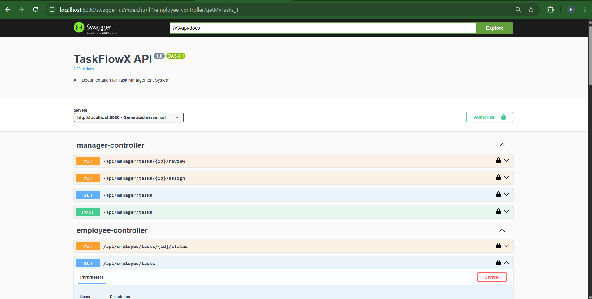 |

---

## 🧾 Output Showcase
Below are some of the sample outputs/APIs of the system:

###  Authentication
| Image | Preview |
|------|--------|
| Unified Login for All Roles | 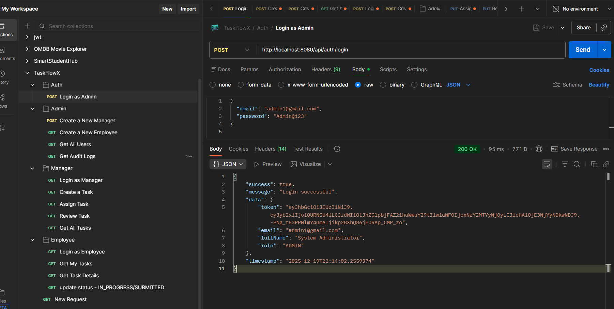 |

###  Admin APIs
| Image | Preview |
|------|--------|
| Create New User | 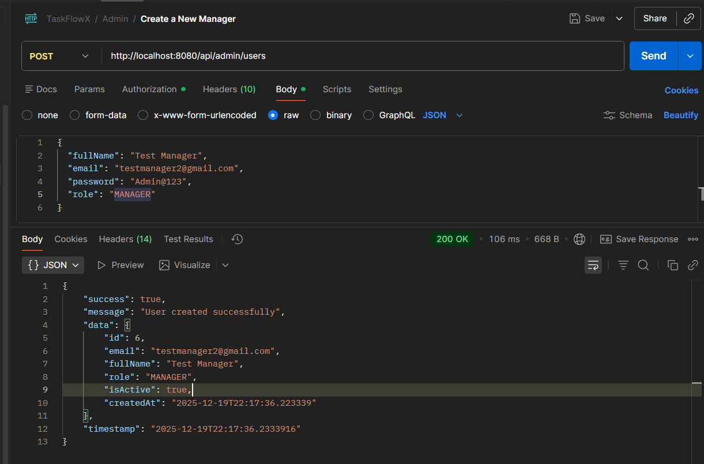 |
| View All Registered Users |  |
| Get Audit Logs | 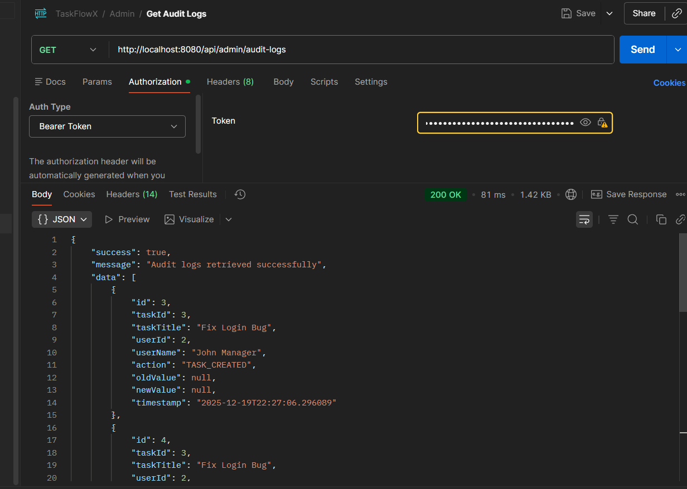 |

###  Manager APIs
| Image | Preview |
|------|--------|
| Create New Task | 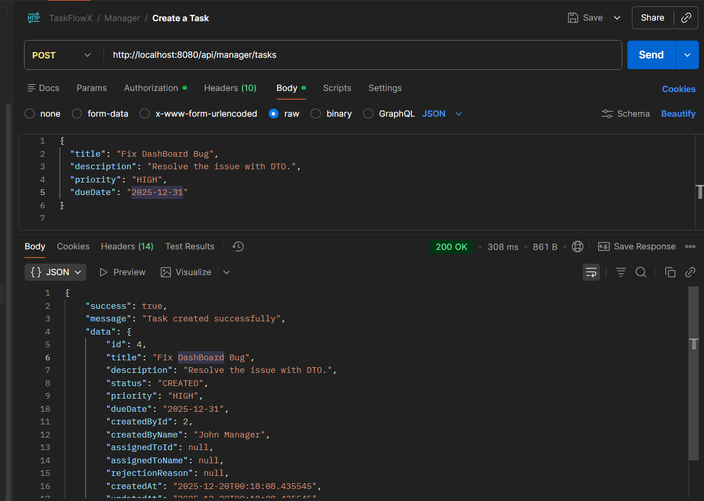 |
| Assign Task to Employee | 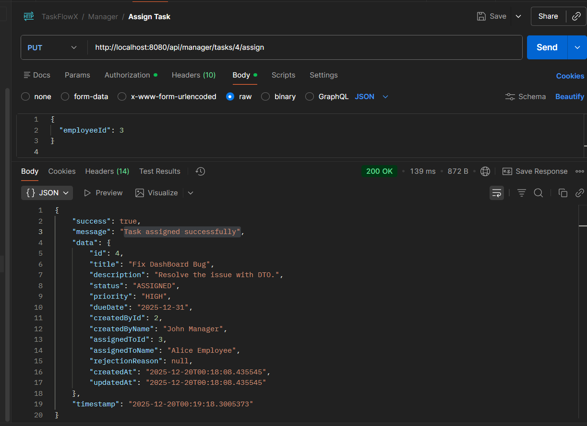 |
| View Tasks Created by Manager | 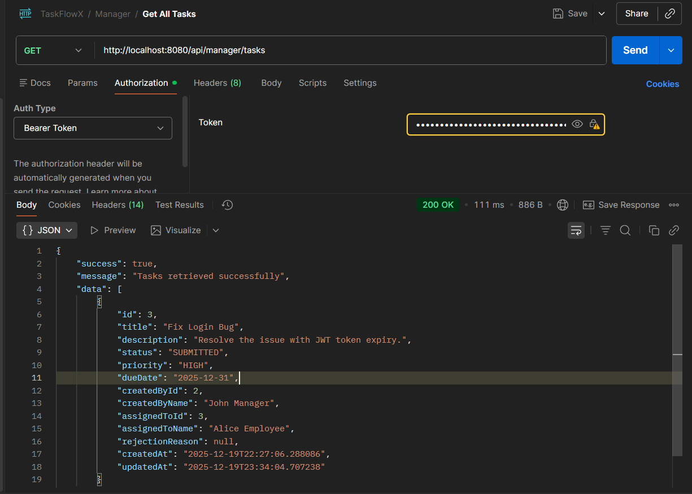 |
| Review Task (Approve or Reject) | 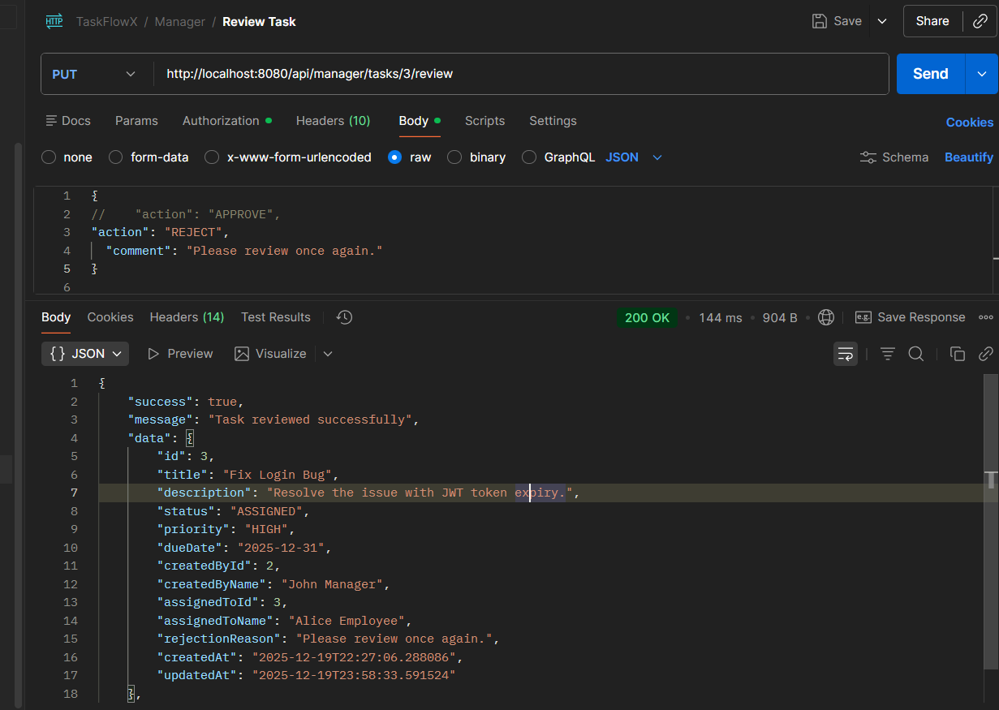 |

###  Employee APIs
| Image | Preview |
|------|--------|
| View Assigned Tasks | 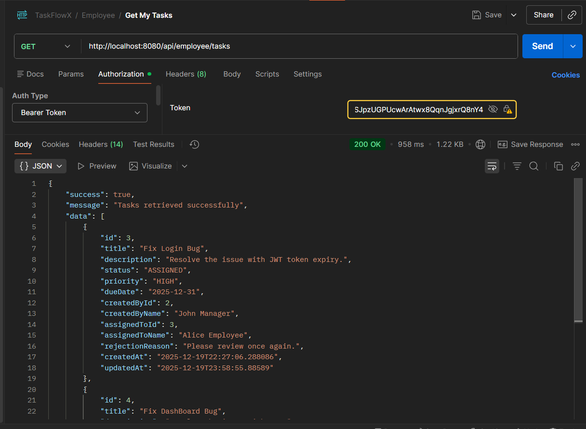 |
| View Task Details | 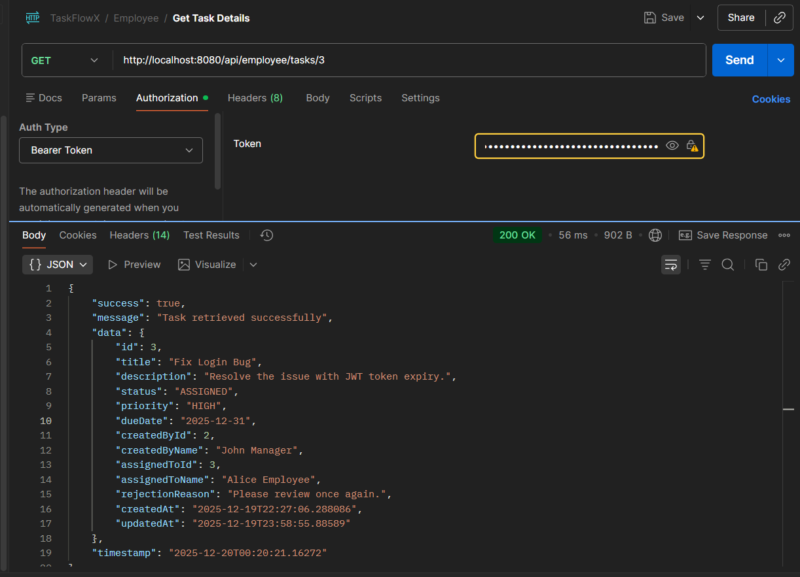 |
| Update Task Status(IN_PROGRESS/SUBMITTED) | 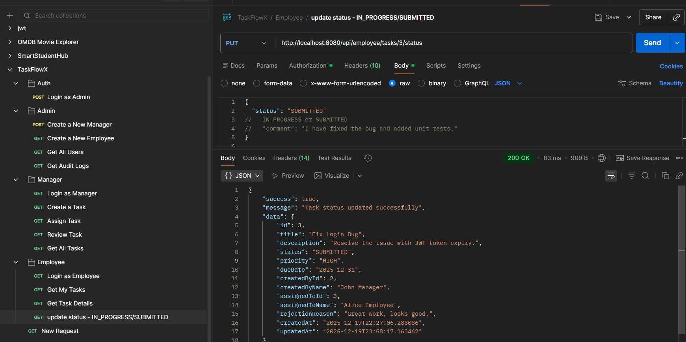 |

---

<details>
<summary>🚀 <b>Future Enhancements</b></summary>

- **Notification Center:** Real-time alerts for task assignment, submission, and review events.
- **Advanced Dashboard Analytics:** Aggregated insights on task performance, turnaround time, and workload distribution.
- **Role Hierarchy Expansion:** Support for additional roles such as Team Lead or Department Head with scoped permissions.
- **File Attachments:** Upload and manage supporting documents or evidence for task submissions.
- **Bulk Task Operations:** Perform bulk assignment, status updates, or approvals for large task sets.

</details>

---

## 📈 Conclusion
**TaskFlowX** demonstrates how **real enterprise backend systems** are designed — with controlled workflows, accountability, and performance in mind.  

---

## 🤝 Happy to Connect  

I'm always open to discussions, collaborations, and feedback!  
Feel free to reach out if you'd like to connect or learn more about this project.  

📧 **Email:** [haridaskhambe2003@gmail.com](mailto:haridaskhambe2003@gmail.com)  
💼 **LinkedIn:** [https://www.linkedin.com/in/haridas-khambe-aa650926b](https://www.linkedin.com/in/haridas-khambe-aa650926b/) 
🌐 **Portfolio:** [Portfolio ](https://haridaskhambe.github.io/react-personal-portfolio/)

⭐ If you find this project helpful or inspiring, consider giving it a star on GitHub!  


